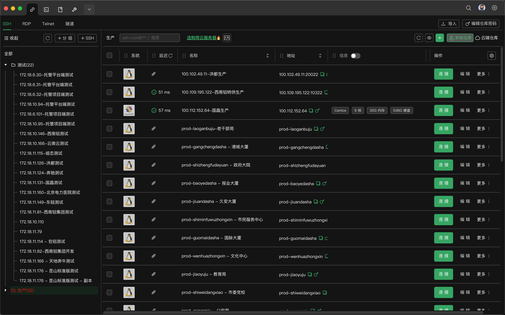
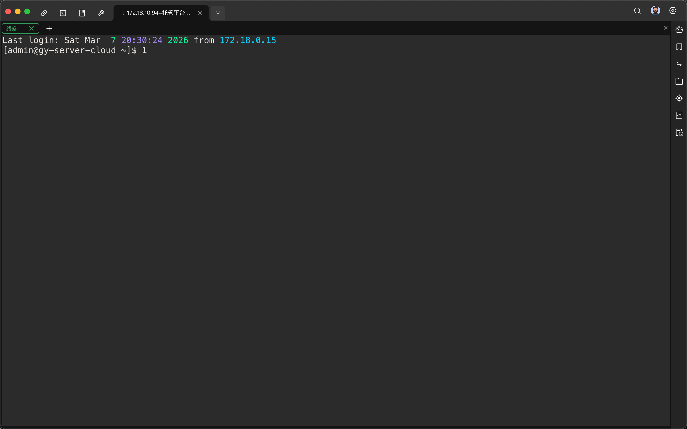

# SSH连接管理工具 - 需求规格说明书

## 文档信息
| 文档名称 | SSH连接管理工具需求规格说明书 |
|---------|------------------------------|
| 版本号 | V1.0 |
| 创建日期 | 2024-03-06 |
| 状态 | 草稿 |

## 修订历史
| 版本 | 日期 | 修订说明 | 修订人 |
|------|------|----------|--------|
| V1.0 | 2024-03-06 | 初始版本创建 | - |

---

# 第一部分：需求文档

## 1. 项目概述

### 1.1 项目背景
开发一款类似于XTerminal的SSH连接管理工具，专注于提供高效的SSH连接管理和文件传输功能，帮助开发者和运维人员更便捷地管理多台服务器。

### 1.2 产品定位
- **核心功能**：SSH连接管理 + 文件传输
- **目标用户**：开发者、系统运维、DevOps工程师
- **平台支持**：Windows、macOS、Linux

### 1.3 核心价值
- 统一管理所有SSH连接
- 高效的文件传输体验
- 简洁直观的用户界面

---

## 2. 功能需求

### 2.1 连接管理模块

#### 2.1.1 连接列表展示
| 功能ID | F-101 | 优先级 | P0 |
|--------|-------|--------|-----|
| **功能名称** | 连接列表展示 | | |
| **功能描述** | 以卡片形式展示所有SSH连接 | | |
| **详细说明** | • 支持分组展示（系统、生产、测试等）<br>• 每个卡片展示：名称、IP地址、延迟、系统类型、配置信息<br>• 支持卡片悬停效果<br>• 显示在线/离线状态<br>• 支持列表/网格两种视图切换 |
| **验收标准** | 用户能清晰看到所有连接的基本信息 | | |

#### 2.1.2 连接操作
| 功能ID | F-102 | 优先级 | P0 |
|--------|-------|--------|-----|
| **功能名称** | 连接操作 | | |
| **功能描述** | 对SSH连接的增删改查操作 | | |
| **详细说明** | • **新建连接**：手动添加新的SSH连接<br>• **编辑连接**：修改现有连接信息<br>• **删除连接**：支持单个/批量删除<br>• **复制连接**：快速复制现有配置<br>• **连接测试**：测试SSH连通性和延迟<br>• **打开终端**：直接打开SSH终端 |
| **验收标准** | 所有操作都能正常执行，数据准确保存 | | |

#### 2.1.3 连接配置
| 功能ID | F-103 | 优先级 | P0 |
|--------|-------|--------|-----|
| **功能名称** | 连接配置 | | |
| **功能描述** | 配置SSH连接的详细参数 | | |
| **详细说明** | **基本配置**：<br>• 名称、分组、标签<br>• 主机名/IP地址<br>• 端口（默认22）<br>• 用户名<br><br>**认证方式**：<br>• 密码认证（可保存密码）<br> |
| **验收标准** | 配置项完整，能成功建立SSH连接 | | |

#### 2.1.4 搜索筛选
| 功能ID | F-104 | 优先级 | P1 |
|--------|-------|--------|-----|
| **功能名称** | 搜索筛选 | | |
| **功能描述** | 快速查找和筛选连接 | | |
| **详细说明** | • 支持按名称、IP、标签关键词搜索<br>• 实时搜索，输入即时过滤<br>• 按分组快速筛选<br>• 按状态（在线/离线）筛选 |
| **验收标准** | 搜索和筛选功能响应迅速，结果准确 | | |

### 2.2 SSH终端模块

#### 2.2.1 多标签管理
| 功能ID | F-201 | 优先级 | P0 |
|--------|-------|--------|-----|
| **功能名称** | 多标签管理 | | |
| **功能描述** | 支持多个SSH终端同时连接 | | |
| **详细说明** | • 支持新建、关闭标签页<br>• 标签显示服务器名称/IP<br>• 支持标签重命名<br>• 支持标签拖拽排序<br>• 标签状态标识（活动、断开） |
| **验收标准** | 可以同时打开多个终端，标签切换流畅 | | |

#### 2.2.2 终端交互
| 功能ID | F-202 | 优先级 | P0 |
|--------|-------|--------|-----|
| **功能名称** | 终端交互 | | |
| **功能描述** | 提供完整的SSH终端交互体验 | | |
| **详细说明** | • 完整的终端模拟器功能<br>• 支持彩色输出显示<br>• 复制/粘贴（支持快捷键）<br>• 命令历史记录（上下键切换）<br>• 自动换行<br>• 终端内搜索（Ctrl+F）<br>• 支持鼠标选择 |
| **验收标准** | 终端操作流畅，与本地终端体验一致 | | |

#### 2.2.3 外观设置
| 功能ID | F-203 | 优先级 | P1 |
|--------|-------|--------|-----|
| **功能名称** | 外观设置 | | |
| **功能描述** | 自定义终端显示样式 | | |
| **详细说明** | • 字体大小调节<br>• 字体类型选择<br>• 主题切换（暗色/亮色）<br>• 背景透明度调节<br>• 光标样式设置 |
| **验收标准** | 外观设置能实时生效 | | |

#### 2.2.4 会话管理
| 功能ID | F-204 | 优先级 | P1 |
|--------|-------|--------|-----|
| **功能名称** | 会话管理 | | |
| **功能描述** | 管理SSH会话状态 | | |
| **详细说明** | • 会话保持（自动重连）<br>• 心跳包配置<br>• 会话日志保存<br>• 会话恢复（重启后恢复标签页） |
| **验收标准** | 网络断开后能自动重连，日志记录完整 | | |

### 2.3 文件管理模块

#### 2.3.1 文件浏览
| 功能ID | F-301 | 优先级 | P0 |
|--------|-------|--------|-----|
| **功能名称** | 文件浏览 | | |
| **功能描述** | 双栏文件管理器，本地和远程文件浏览 | | |
| **详细说明** | • 左侧本地文件树，右侧远程文件树<br>• 地址栏显示当前路径<br>• 前进/后退导航<br>• 刷新文件列表<br>• 文件类型图标显示<br>• 文件大小、修改时间、权限显示 |
| **验收标准** | 能正常浏览本地和远程文件系统 | | |

#### 2.3.2 文件操作
| 功能ID | F-302 | 优先级 | P0 |
|--------|-------|--------|-----|
| **功能名称** | 文件操作 | | |
| **功能描述** | 基本的文件管理操作 | | |
| **详细说明** | • **上传**：本地→远程<br>• **下载**：远程→本地<br>• **新建文件夹**<br>• **删除**（支持批量）<br>• **重命名**<br>• **复制/粘贴**<br>• **拖拽操作**（支持拖拽上传下载） |
| **验收标准** | 所有文件操作都能正常执行 | | |

#### 2.3.3 传输管理
| 功能ID | F-303 | 优先级 | P0 |
|--------|-------|--------|-----|
| **功能名称** | 传输管理 | | |
| **功能描述** | 管理文件传输任务 | | |
| **详细说明** | • 显示传输队列<br>• 进度条显示<br>• 传输速度显示<br>• 剩余时间预估<br>• 暂停/继续传输<br>• 取消/重试<br>• 传输完成通知 |
| **验收标准** | 传输任务清晰可见，控制灵活 | | |

#### 2.3.4 高级文件功能
| 功能ID | F-304 | 优先级 | P2 |
|--------|-------|--------|-----|
| **功能名称** | 高级文件功能 | | |
| **功能描述** | 增强的文件处理功能 | | |
| **详细说明** | • 文件压缩/解压（ZIP、TAR、GZ）<br>• 文件权限修改<br>• 文件搜索<br>• 文件编辑（内置编辑器）<br>• 断点续传<br>• 文件对比（Diff） |
| **验收标准** | 高级功能稳定可用 | | |

### 2.4 系统功能模块

#### 2.4.1 数据存储
| 功能ID | F-401 | 优先级 | P0 |
|--------|-------|--------|-----|
| **功能名称** | 数据存储 | | |
| **功能描述** | 配置数据的存储管理 | | |
| **详细说明** | • 本地加密存储（SQLite + 加密）<br>• 密码和密钥安全存储<br>• 自动保存修改<br>• 数据备份 |
| **验收标准** | 数据安全存储，不丢失 | | |

#### 2.4.2 导入/导出
| 功能ID | F-402 | 优先级 | P1 |
|--------|-------|--------|-----|
| **功能名称** | 导入/导出 | | |
| **功能描述** | 连接配置的导入导出功能 | | |
| **详细说明** | • 导出为JSON/YAML格式<br>• 从JSON/YAML导入<br>• 批量导入（Excel/CSV模板）<br>• 导出加密（密码保护） |
| **验收标准** | 导入导出数据完整准确 | | |

#### 2.4.3 快捷键支持
| 功能ID | F-403 | 优先级 | P1 |
|--------|-------|--------|-----|
| **功能名称** | 快捷键支持 | | |
| **功能描述** | 常用操作的快捷键 | | |
| **详细说明** | • 新建连接：Ctrl+N<br>• 新建终端：Ctrl+T<br>• 关闭标签：Ctrl+W<br>• 复制：Ctrl+Shift+C<br>• 粘贴：Ctrl+Shift+V<br>• 搜索：Ctrl+F<br>• 全屏：F11 |
| **验收标准** | 快捷键响应正确，可自定义 | | |

#### 2.4.4 多语言支持
| 功能ID | F-404 | 优先级 | P1 |
|--------|-------|--------|-----|
| **功能名称** | 多语言支持 | | |
| **功能描述** | 界面语言切换 | | |
| **详细说明** | • 中文界面<br>• 英文界面<br>• 跟随系统语言 |
| **验收标准** | 语言切换后界面完整显示 | | |

---

## 3. 非功能需求

### 3.1 性能需求
| 需求ID | NF-101 | 优先级 | P0 |
|--------|--------|--------|-----|
| **需求名称** | 启动速度 | | |
| **详细说明** | 软件启动时间不超过3秒 | | |

| 需求ID | NF-102 | 优先级 | P0 |
|--------|--------|--------|-----|
| **需求名称** | 内存占用 | | |
| **详细说明** | 空闲状态内存占用不超过200MB | | |

| 需求ID | NF-103 | 优先级 | P1 |
|--------|--------|--------|-----|
| **需求名称** | 大文件传输 | | |
| **详细说明** | 支持传输大于4GB的文件 | | |

### 3.2 安全需求
| 需求ID | NF-201 | 优先级 | P0 |
|--------|--------|--------|-----|
| **需求名称** | 密码加密 | | |
| **详细说明** | 所有保存的密码必须加密存储 | | |

| 需求ID | NF-202 | 优先级 | P1 |
|--------|--------|--------|-----|
| **需求名称** | 密钥保护 | | |
| **详细说明** | 私钥文件可设置密码保护 | | |

### 3.3 可用性需求
| 需求ID | NF-301 | 优先级 | P0 |
|--------|--------|--------|-----|
| **需求名称** | 操作响应 | | |
| **详细说明** | 用户操作响应时间不超过100ms | | |

| 需求ID | NF-302 | 优先级 | P1 |
|--------|--------|--------|-----|
| **需求名称** | 错误提示 | | |
| **详细说明** | 错误信息清晰易懂，提供解决方案 | | |

---

## 4. 功能优先级汇总

### P0（核心功能，必须完成）
- 连接列表展示
- 连接增删改查
- SSH终端基础功能
- 文件上传/下载
- 数据加密存储

### P1（重要功能，建议完成）
- 搜索筛选
- 外观设置
- 会话管理
- 导入/导出
- 快捷键
- 多语言

### P2（增强功能，后续迭代）
- 高级文件功能
- 命令片段
- 资源监控
- 团队协作

---

# 第二部分：UI原型设计

## 1. 整体布局结构

```
+------------------------------------------------------------------------------+
|  [顶部导航栏]                                                                |
+------------------------------------------------------------------------------+
|        |                                                                     |
| [左侧  |  [中间主内容区]                                                     |
|  导航栏]|                                                                     |
|        |                                                                     |
|        |                                                                     |
|        |                                                                     |
|        |                                                                     |
|        |                                                                     |
|        |                                                                     |
+------------------------------------------------------------------------------+
|  [底部状态栏]                                                                |
+------------------------------------------------------------------------------+
```

---

## 2. 主界面原型

### 2.1 布局尺寸建议
- **顶部导航栏**：高度 48px
- **左侧导航栏**：宽度 240px
- **底部状态栏**：高度 32px
- **中间内容区**：自适应剩余空间

### 2.2 主界面原型图



## 3. SSH终端界面原型

### 3.1 终端主界面



### 3.2 右键菜单

```
在终端内右键:
+---------------------+
| 复制                | Ctrl+Shift+C
| 粘贴                | Ctrl+Shift+V
| ------------------  |
| 全选                |
| 清屏                |
| ------------------  |
| 搜索...             | Ctrl+F
+---------------------+

```

### 3.3 终端搜索界面


## 4. 文件管理界面原型

### 4.1 双栏文件管理器

```
+------------------------------------------------------------------------------+
| [web-server@192.168.1.10 - 文件管理] [x]                                     |
+------------------------------------------------------------------------------+
| [📁] 本地: C:\Users\admin\Projects\  [▼]  [↻]                                |
| [📁] 远程: /home/user/webapp/        [▼]  [↻]                                |
+----------------------------------+-------------------------------------------+
| [⬆️] [⬇️] [📁新建] [✏️重命名] [🗑️删除] [🔍搜索] [⚙️]                          |
+----------------------------------+-------------------------------------------+
| 本地文件                         | 远程文件                                  |
+----------------------------------+-------------------------------------------+
| 名称       大小   修改时间       | 名称       大小   修改时间      权限     |
| ../../                          | ../../                                    |
| 📁 src       -    03-06 10:30   | 📁 public     -    03-06 09:15   755     |
| 📁 config    -    03-06 09:20   | 📁 logs       -    03-06 08:30   755     |
| 📄 index.js  2KB  03-06 10:25   | 📄 app.js     8KB  03-05 16:20   644     |
| 📄 package.json 1KB 03-06 09:15 | 📄 config.json 1KB 03-05 14:30   644     |
| 📄 README.md  3KB  03-05 17:30  | 📄 server.js  12KB 03-04 11:20   644     |
| 📦 build.zip  15MB 03-04 09:00  | 📦 backup.tar 256MB 03-03 23:00  600     |
| 📁 node_modules -  03-03 15:20  | 📁 cache       -   03-06 07:45   755     |
| 📁 test        -  03-02 11:00   | 📁 tmp         -   03-06 06:30   777     |
| 📄 .gitignore  1KB  03-01 09:30 | 📄 .env        1KB 03-05 10:15   600     |
+----------------------------------+-------------------------------------------+
|                                                                              |
+----------------------------------+-------------------------------------------+
| 传输队列: [展开] [▼]                                                         |
| 📄 build.zip → /home/user/ ████████░░ 80% 12MB/15MB 1.2MB/s 剩余3s [暂停] [x]|
| 📄 backup.tar ← /home/user/ ████░░░░░░ 40% 102MB/256MB 800KB/s 剩余3m [取消] |
+------------------------------------------------------------------------------+
```

### 4.2 新建文件夹/上传界面

```
上传文件弹窗:
+----------------------------------+
| 上传文件到 /home/user/webapp/    |
+----------------------------------+
| 选择文件: [选择文件] 5个文件选中 |
|                                  |
| 📄 index.js    2KB              |
| 📄 style.css   4KB              |
| 📄 app.js      8KB              |
| 📄 utils.js    3KB              |
| 📄 main.js     5KB              |
|                                  |
| 目标路径: /home/user/webapp/src/ [浏览] |
|                                  |
| 冲突处理: ●覆盖 ○跳过 ○重命名     |
|                                  |
| [上传] [取消]                    |
+----------------------------------+

新建文件夹弹窗:
+----------------------------------+
| 新建文件夹                       |
+----------------------------------+
| 位置: ●本地 ○远程                |
| 路径: /home/user/webapp/         |
|                                  |
| 文件夹名称: [                   ]|
|                                  |
| [创建] [取消]                    |
+----------------------------------+
```

### 4.3 文件编辑界面

```
+------------------------------------------------------------------------------+
| 编辑文件 - /home/user/webapp/config.json [x]                                 |
+------------------------------------------------------------------------------+
| 1 {                                                                          |
| 2   "name": "webapp",                                                        |
| 3   "version": "1.0.0",                                                      |
| 4   "description": "Main web application",                                   |
| 5   "main": "server.js",                                                     |
| 6   "scripts": {                                                             |
| 7     "start": "node server.js",                                             |
| 8     "dev": "nodemon server.js",                                            |
| 9     "test": "jest"                                                         |
| 10  },                                                                       |
| 11  "dependencies": {                                                        |
| 12    "express": "^4.18.2",                                                  |
| 13    "mongoose": "^7.0.3",                                                  |
| 14    "cors": "^2.8.5",                                                      |
| 15    "dotenv": "^16.0.3"                                                    |
| 16  },                                                                       |
| 17  "devDependencies": {                                                     |
| 18    "nodemon": "^2.0.22",                                                  |
| 19    "jest": "^29.5.0"                                                      |
| 20  }                                                                        |
| 21 }                                                                         |
+------------------------------------------------------------------------------+
| [保存] [另存为] [撤销] [重做] [查找] [替换] [设置] [关闭]                    |
+------------------------------------------------------------------------------+
```

---

## 5. 新建/编辑连接界面原型

### 5.1 新建连接弹窗

```
+--------------------------------------------------+
|  ✏️ 新建SSH连接                                   |
+--------------------------------------------------+
|                                                  |
|  [基本配置] [高级配置] [认证] [标签]              |
|                                                  |
|  * 名称: [web-server                           ]|
|                                                  |
|  * 主机: [192.168.1.10                          ]|
|                                                  |
|  * 端口: [22                  ]                  |
|                                                  |
|  * 用户名: [root                                ]|
|                                                  |
|  分组: [生产              ▼] [新建分组]          |
|                                                  |
|  备注: [生产环境Web服务器，运行Nginx+Node.js    ]|
|                                                  |
|                                                  |
|  认证方式:                                        |
|  ○ 密码                                          |
|  ● 密钥                                          |
|                                                  |
|  私钥文件: [/Users/admin/.ssh/id_rsa    [浏览]   |
|  密钥密码: [********                    ]        |
|                                                  |
|  [测试连接]                         [保存] [取消] |
+--------------------------------------------------+
```

### 5.2 高级配置标签页

```
+--------------------------------------------------+
|  ✏️ 编辑连接 - web-server                         |
+--------------------------------------------------+
|                                                  |
|  [基本配置] [高级配置] [认证] [标签]              |
|                                                  |
|  超时设置:                                        |
|  连接超时: [30               ] 秒                 |
|  会话超时: [0                ] 秒 (0为不超时)      |
|                                                  |
|  代理设置:                                        |
|  ● 无代理 ○ HTTP代理 ○ SOCKS代理                   |
|                                                  |
|  跳板机:                                          |
|  [✚ 添加跳板机]                                   |
|  └─ 无跳板机                                      |
|                                                  |
|  编码设置:                                        |
|  [UTF-8                    ▼]                    |
|                                                  |
|  KeepAlive:                                      |
|  [✓] 启用心跳包 [60] 秒间隔                        |
|                                                  |
|  [保存] [取消]                                    |
+--------------------------------------------------+
```

### 5.3 标签管理界面

```
+--------------------------------------------------+
|  ✏️ 编辑连接 - web-server                         |
+--------------------------------------------------+
|                                                  |
|  [基本配置] [高级配置] [认证] [标签]              |
|                                                  |
|  添加标签:                                        |
|  [生产环境                 ] [➕ 添加]             |
|                                                  |
|  已添加标签:                                      |
|  [Web] [x]  [生产] [x]  [Nginx] [x]               |
|  [主站] [x]  [重要] [x]                            |
|                                                  |
|  常用标签:                                        |
|  点击快速添加:                                     |
|  数据库  缓存  测试  开发  工具  监控               |
|                                                  |
|  [保存] [取消]                                    |
+--------------------------------------------------+
```

---

## 6. 导入/导出界面原型

### 6.1 导入配置弹窗

```
+--------------------------------------------------+
|  📥 导入连接配置                                  |
+--------------------------------------------------+
|                                                  |
|  选择导入方式:                                     |
|  ● 从文件导入  ○ 从剪贴板导入                      |
|                                                  |
|  文件格式:                                        |
|  [JSON ▼]                                        |
|                                                  |
|  选择文件: [选择文件] example_connections.json     |
|                                                  |
|  导入选项:                                        |
|  [✓] 覆盖重名连接                                  |
|  [✓] 保留原有分组                                  |
|  [ ] 导入后自动连接测试                            |
|                                                  |
|  预览:                                            |
|  ┌──────────────────────────────────┐            |
|  | 将导入以下连接:                    |            |
|  | ✓ web-server (192.168.1.10)      |            |
|  | ✓ db-server (192.168.1.20)       |            |
|  | ✓ cache-server (192.168.1.30)    |            |
|  | ⚠️ app-server (已存在，将被覆盖)    |            |
|  └──────────────────────────────────┘            |
|                                                  |
|  [导入] [取消]                                    |
+--------------------------------------------------+
```

### 6.2 导出配置弹窗

```
+--------------------------------------------------+
|  📤 导出连接配置                                  |
+--------------------------------------------------+
|                                                  |
|  选择要导出的连接:                                 |
|                                                  |
|  [✓] 全选                                        |
|  [✓] 系统 (8个连接)                               |
|  [✓] 生产 (12个连接)                              |
|  [✓] 测试 (7个连接)                               |
|  [ ] 开发 (5个连接)                               |
|                                                  |
|  导出格式: [JSON ▼]                               |
|                                                  |
|  加密选项:                                        |
|  [ ] 加密导出文件                                  |
|     密码: [                        ]              |
|     确认密码: [                        ]          |
|                                                  |
|  导出内容:                                        |
|  [✓] 包含密码 (加密存储)                          |
|  [✓] 包含密钥路径 (不包含密钥内容)                 |
|  [✓] 包含标签和备注                               |
|                                                  |
|  [导出] [取消]                                    |
+--------------------------------------------------+
```

---

## 7. 命令片段管理界面

### 7.1 命令片段面板

```
+--------------------------------------------------+
|  📋 命令片段管理                                  |
+--------------------------------------------------+
|                                                  |
|  [🔍 搜索命令...]               [➕ 新建片段]       |
|                                                  |
|  📁 所有片段 (15)                                |
|  📁 系统管理 (4)                                 |
|  📁 日志查看 (3)                                 |
|  📁 服务管理 (3)                                 |
|  📁 磁盘操作 (2)                                 |
|  📁 网络工具 (3)                                 |
|                                                  |
|  +--------------------------------------------+  |
|  | 查看Nginx日志                              |  |
|  | tail -f /var/log/nginx/access.log          |  |
|  | 📁 日志查看 · 🏷️ nginx                      |  |
|  | [执行] [编辑] [复制]                        |  |
|  +--------------------------------------------+  |
|                                                  |
|  +--------------------------------------------+  |
|  | 查看系统资源                                |  |
|  | top -c                                     |  |
|  | 📁 系统管理 · 🏷️ 监控                       |  |
|  | [执行] [编辑] [复制]                        |  |
|  +--------------------------------------------+  |
|                                                  |
|  [关闭]                                          |
+--------------------------------------------------+
```

### 7.2 新建命令片段

```
+--------------------------------------------------+
|  ✏️ 新建命令片段                                  |
+--------------------------------------------------+
|                                                  |
|  * 名称: [查看Nginx错误日志                      ]|
|                                                  |
|  分组: [日志查看              ▼] [新建分组]       |
|                                                  |
|  标签: [nginx, 错误, 调试]                        |
|                                                  |
|  * 命令:                                        |
|  ┌────────────────────────────────────┐         |
|  | tail -f /var/log/nginx/error.log   |         |
|  |                                    |         |
|  |                                    |         |
|  └────────────────────────────────────┘         |
|                                                  |
|  描述:                                          |
|  ┌────────────────────────────────────┐         |
|  | 实时查看Nginx错误日志，用于调试问题  |         |
|  └────────────────────────────────────┘         |
|                                                  |
|  快捷键: [Ctrl+Alt+N] [设置]                     |
|                                                  |
|  [保存] [取消]                                   |
+--------------------------------------------------+
```

---

## 8. 设置界面原型

### 8.1 常规设置

```
+--------------------------------------------------+
|  ⚙️ 设置                                         |
+--------------------------------------------------+
|                                                  |
|  [常规] [外观] [终端] [文件传输] [快捷键] [关于]   |
|                                                  |
|  启动设置:                                       |
|  [✓] 开机自启动                                  |
|  [ ] 启动时最小化到系统托盘                        |
|  [✓] 启动时恢复上次会话                            |
|                                                  |
|  连接设置:                                       |
|  默认连接超时: [30] 秒                            |
|  自动重连: [✓] 启用 [3] 次尝试 [5] 秒间隔          |
|                                                  |
|  数据存储:                                       |
|  配置文件路径: [/Users/admin/.ssh-manager] [浏览] |
|  [✓] 自动备份 [每天]                             |
|                                                  |
|  更新设置:                                       |
|  [✓] 自动检查更新                                |
|  [⚡] 立即检查更新                                |
|                                                  |
|  [保存] [取消] [恢复默认]                         |
+--------------------------------------------------+
```

### 8.2 外观设置

```
+--------------------------------------------------+
|  ⚙️ 设置 - 外观                                  |
+--------------------------------------------------+
|                                                  |
|  [常规] [外观] [终端] [文件传输] [快捷键] [关于]   |
|                                                  |
|  主题模式:                                       |
|  ● 深色 ○ 浅色 ○ 跟随系统                          |
|                                                  |
|  强调色: [■ 蓝色] [■ 绿色] [■ 紫色] [自定义]       |
|                                                  |
|  字体设置:                                       |
|  界面字体: [系统默认                 ▼] [14px]    |
|  终端字体: [JetBrains Mono          ▼] [14px]    |
|                                                  |
|  界面缩放: [100% ▼]                              |
|                                                  |
|  卡片显示:                                       |
|  [✓] 显示系统图标                                |
|  [✓] 显示延迟                                    |
|  [ ] 显示详细信息 (CPU/内存/硬盘)                  |
|                                                  |
|  预览:                                           |
|  +-----------------+                            |
|  | [🖥️] web-server  |                            |
|  | 192.168.1.10    |                            |
|  | [●] 在线 12ms   |                            |
|  +-----------------+                            |
|                                                  |
|  [保存] [取消] [恢复默认]                         |
+--------------------------------------------------+
```

---

## 9. 响应式设计适配

### 9.1 小屏幕适配 (宽度 < 1200px)

```
+----------------------------------+
| [⚡] SSH管理  [🔍] [👤] [⚙️]      |
+----------------------------------+
| [📁] 分组  [全部] [系统] [生产]   |
+----------------------------------+
| +-----------------------------+  |
| | [🖥️] web-server      [⋮]    |  |
| | 192.168.1.10 [●] 12ms       |  |
| | Ubuntu 4核 8G 100G          |  |
| | [连接] [编辑]                |  |
| +-----------------------------+  |
| +-----------------------------+  |
| | [🖥️] db-server       [⋮]    |  |
| | 192.168.1.20 [●] 15ms       |  |
| | CentOS 8核 16G 500G         |  |
| | [连接] [编辑]                |  |
| +-----------------------------+  |
+----------------------------------+
| [<] 1 2 3 ... 10 [>]            |
+----------------------------------+
```

### 9.2 移动端适配 (宽度 < 768px)

```
+--------------------------+
| [≡] SSH管理  [🔍] [👤]   |
+--------------------------+
| [全部] [系统] [生产] [测试]|
+--------------------------+
| [🖥️] web-server          |
| 192.168.1.10            |
| [●] 12ms Ubuntu 20.04    |
| 4核 | 8G | 100G         |
| [连接] [编辑] [更多]      |
+--------------------------+
| [🖥️] db-server           |
| 192.168.1.20            |
| [●] 15ms CentOS 8       |
| 8核 | 16G | 500G        |
| [连接] [编辑] [更多]      |
+--------------------------+
```

---

## 10. 颜色规范

### 10.1 深色主题
| 元素 | 色值 | 用途 |
|------|------|------|
| 背景主色 | #1E1E1E | 主窗口背景 |
| 背景次色 | #252526 | 侧边栏、面板背景 |
| 卡片背景 | #2D2D30 | 连接卡片 |
| 强调色 | #007ACC | 按钮、选中项 |
| 文字主色 | #CCCCCC | 主要文字 |
| 文字次色 | #999999 | 辅助文字 |
| 在线状态 | #4EC9B0 | 绿色 |
| 离线状态 | #F48771 | 红色 |
| 边框色 | #3F3F46 | 分割线 |

### 10.2 亮色主题
| 元素 | 色值 | 用途 |
|------|------|------|
| 背景主色 | #F3F3F3 | 主窗口背景 |
| 背景次色 | #ECECEC | 侧边栏、面板背景 |
| 卡片背景 | #FFFFFF | 连接卡片 |
| 强调色 | #007ACC | 按钮、选中项 |
| 文字主色 | #333333 | 主要文字 |
| 文字次色 | #666666 | 辅助文字 |
| 在线状态 | #4EC9B0 | 绿色 |
| 离线状态 | #F48771 | 红色 |
| 边框色 | #D4D4D4 | 分割线 |

### 10.3 UI 组件库
Ant Design

---

## 11. 交互规范

### 11.1 悬停效果
- **连接卡片**：轻微上浮，阴影加深
- **按钮**：背景色变深，可能有微动效
- **标签页**：下划线或背景色变化

### 11.2 点击效果
- **按钮**：轻微缩小效果 (0.98倍)
- **选中项**：强调色边框或背景

### 11.3 动画过渡
- 所有交互变化使用 0.2s 缓动
- 面板展开/折叠使用 0.3s 缓动

### 11.4 右键菜单
- 右键点击连接卡片弹出上下文菜单
- 右键点击终端区域弹出终端菜单
- 右键点击文件列表弹出文件操作菜单

---

## 12. 图标建议

| 用途 | 推荐图标 | 说明 |
|------|----------|------|
| 应用图标 | ⚡ | 闪电，表示快速连接 |
| 连接 | 🔌 | 插头，表示连接 |
| 终端 | 💻 | 电脑，表示终端 |
| 文件 | 📁 | 文件夹，表示文件管理 |
| 上传 | ⬆️ | 向上箭头 |
| 下载 | ⬇️ | 向下箭头 |
| 新建 | ➕ | 加号 |
| 编辑 | ✏️ | 铅笔 |
| 删除 | 🗑️ | 垃圾桶 |
| 搜索 | 🔍 | 放大镜 |
| 设置 | ⚙️ | 齿轮 |
| 在线 | ● | 实心圆 |
| 离线 | ○ | 空心圆 |
| 延迟 | ⏱️ | 秒表 |

---

